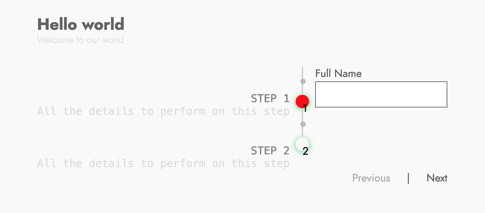

# svelte advanced multistep form [](https://npmjs.org/package/svelte-advanced-multistep-form)


Multi Step Form help to wrap form elements passing down styles to the component to be rendered, also it presents each form step in a ordered and stylish way.

### Demo
<p align="center">
  
</p>


## Install

```
npm install svelte-advanced-multistep-form
```

then import into your code

```javascript
  import { Form, Step } from "svelte-advanced-multistep-form";
```
## Usage

First you need to set up the form `stepsDescription`, `formSubtitle`, `formTitle`, `formMethodType`, `prevMessageText` and `nextMessageText` inside `multiStepOptions` that later has to be injected into Form component `<Form {multiStepOptions}>`

```javascript
  let multiStepOptions = {
    formTitle : 'Hello world',
    formSubtitle : 'Welcome to our world',
    formMethodType : 'POST',
    prevMessageText : 'Previous',
    nextMessageText : 'Next',
    formActionURL:'/',
    formID : 's-multistep-form',
    displayIndex : true,
    svgCircleColor : "#48DB71",
    selectCircleColor : "red",
    selectboxShadowCircleColor :  "#48DB71",
    unselectboxShadowCircleColor : "#48DB71",
    indexblanckColor : 'black',
    indexColor : 'black',
    stepsDescription: [{
        title: "STEP 1",
        subtitle: "All the details to perform on this step",
        icon : "fa fa-info-circle"
      },
      {
        title: "STEP 2",
        subtitle: "All the details to perform on this step",
        icon : "fa fa-info-circle"
      }
    ]
  }
```

After that you only need to call `Form` and `Step` component in the following way

For `Step`you can use Font-Awesome icons.

```html
<Form {multiStepOptions}>
  <Step>
   // Here should be your form
  </Step>
</Form>
```

You can customize the form using CSS as you want it. :) 

## Submit form data

```html
<script> 
import axios from "axios";
import { Form, Step } from "svelte-advanced-multistep-form";

llet multiStepOptions = {
    formTitle : 'Hello world',
    formSubtitle : 'Welcome to our world',
    formMethodType : 'POST',
    prevMessageText : '<button>Previous<button>',
    nextMessageText : '<button>Next</button>',
    formActionURL:'/',
    formID : 's-multistep-form',
    displayIndex : true,
    svgCircleColor : "#48DB71",
    selectCircleColor : "red",
    selectboxShadowCircleColor :  "#48DB71",
    unselectboxShadowCircleColor : "#48DB71",
    indexblanckColor : 'black',
    indexColor : 'black',
    stepsDescription: [{
        title: "STEP 1",
        subtitle: "All the details to perform on this step",
        icon : "fa fa-info-circle"
      },
      {
        title: "STEP 2",
        subtitle: "All the details to perform on this step",
        icon : "fa fa-info-circle"
      }
    ]
  };
let myInputValue; 

const handleSubmit = () => {
  const formValues = {
    firstStepInput: myInputValue,
  };
  axios.post('http://my-internal-api/submit', formValues)
  myInputValue = ''
}
</script>

<Form {multiStepOptions}>
  <Step>
   <input
    class="your-custom-class"
    id="form-field"
    bind:value={myInputValue}
    placeholder="value here..." /> 
  </Step>
  <Step>
    <button
      class="your-custom-class"
      on:click|preventDefault={handleSubmit}>
      Save me
    </button>
  </Step>
</Form>
```

## Examples 

checkout `/examples` folder, run the following commands in order to run examples:

```bash
cd examples
npm i 
npm run dev
```

Go to http://localhost:5000 to see it in action 🔥

